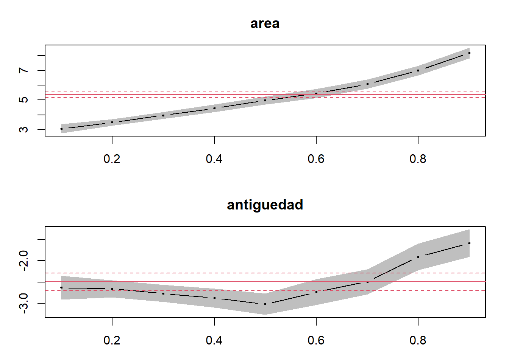
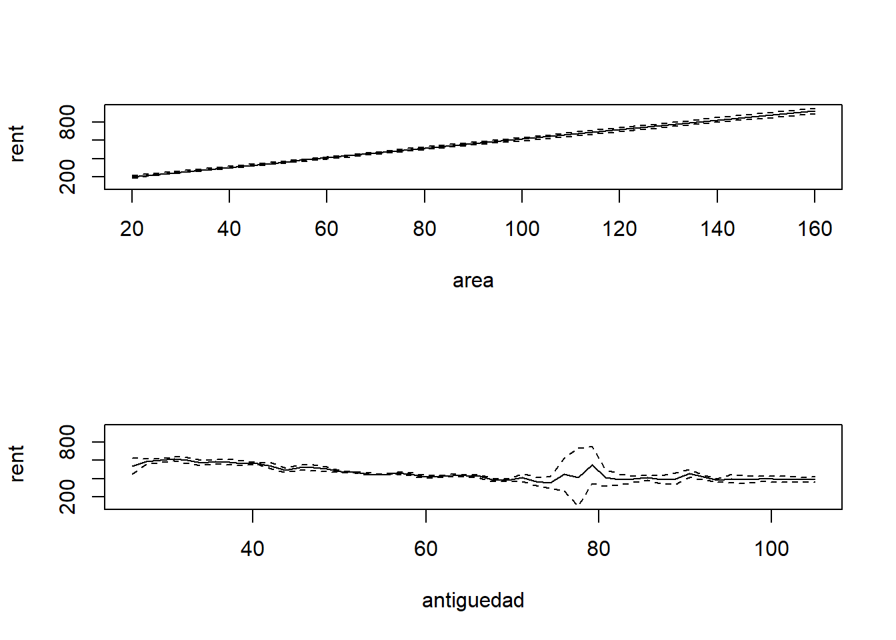
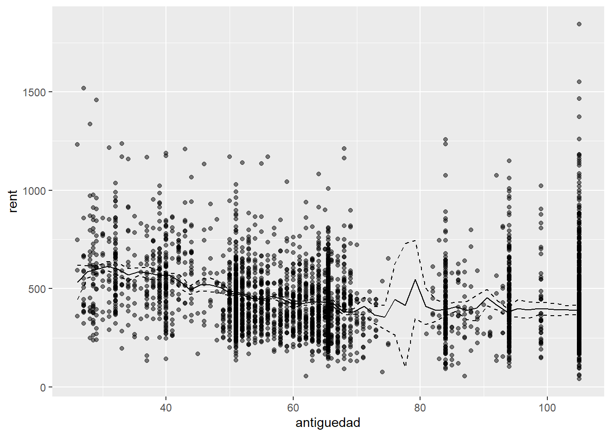

# Respuestas


::: {.cell}

```{.r .cell-code}
knitr::opts_chunk$set(echo = TRUE,
                      warning = FALSE,
                      message = FALSE,
                      indent = "   ")
library(tidyverse)
library(janitor)
library(sandwich)
library(clubSandwich)
library(plm)
library(stargazer)
library(lmtest)
library(AER)
library(quantreg)
library(np)
```
:::


## Pregunta 1

Considere los datos en el archivo *capital_trabajo.csv*. Con una función de producción Cobb-Douglas las participaciones del capital y el trabajo en el valor de la producción se pueden estimar usando una regresión lineal. En algunas aplicaciones es de interés conocer el cociente de las participaciones estimadas.

a. [10 puntos] Usando 500 repeticiones bootstrap estime el error estándar del cociente capital-trabajo. Para ello realice el siguiente procedimiento:
    i. Genere una matriz vacía de 500 filas para coleccionar sus relaciones estimadas.
    i. En cada una de las repeticiones obtenga una muestra con remplazo a partir de la muestra original.
    i. Estime por MCO los coeficientes sobre el log del capital y el log del trabajo. La variable dependiente es el log del valor de la producción. Calcule el cociente de los coeficientes estimados. Guarde el cociente en la matriz.
    i. Repita ii. y iii. 500 veces.
    i. Calcule la desviación estándar de los cocientes estimados.

   *En cada repetición bootstrap debemos estimar el siguiente modelo y obtener el ratio de los coeficientes:*
    

   ::: {.cell}
   
   ```{.r .cell-code}
   data.kl <- read_csv("../files/capital_trabajo.csv") 
   
   summary(m1 <- lm(lvalor ~ lcapital + ltrabajo, data=data.kl))
   ```
   
   ::: {.cell-output .cell-output-stdout}
   ```
   
   Call:
   lm(formula = lvalor ~ lcapital + ltrabajo, data = data.kl)
   
   Residuals:
        Min       1Q   Median       3Q      Max 
   -0.53523 -0.25678  0.03835  0.26003  0.49631 
   
   Coefficients:
               Estimate Std. Error t value Pr(>|t|)    
   (Intercept) 10.56478    0.05303  199.24   <2e-16 ***
   lcapital     0.38502    0.03072   12.53   <2e-16 ***
   ltrabajo     0.66108    0.02813   23.50   <2e-16 ***
   ---
   Signif. codes:  0 '***' 0.001 '**' 0.01 '*' 0.05 '.' 0.1 ' ' 1
   
   Residual standard error: 0.2999 on 97 degrees of freedom
   Multiple R-squared:  0.8768,	Adjusted R-squared:  0.8742 
   F-statistic: 345.1 on 2 and 97 DF,  p-value: < 2.2e-16
   ```
   :::
   :::

   *Fijamos una semilla y los parámetros de la rutina:*
   

   ::: {.cell}
   
   ```{.r .cell-code}
   set.seed(120)
   B=500
   obs <- nrow(data.kl)
   beta <- data.frame(beta=matrix(ncol = 1, nrow = B))
   ```
   :::


   *Realizamos la regresión y el cálculo del cociente en cada una de las $b$ repeticiones:*
   

   ::: {.cell}
   
   ```{.r .cell-code}
   for (i in 1:B)
   {
     data.b <-data.kl[sample(nrow(data.kl),obs, replace = TRUE),]
     
     #Corremos regresión
     
     m<-lm(lvalor ~ lcapital + ltrabajo,
           data=data.b)
     
     #Guardamos en cada entrada el ratio estimado
     beta[i,1] <- as.numeric(m$coefficients[2] / m$coefficients[3])
   }
   ```
   :::


   *El error estimado es simplemente la desviación estándar de los B estadísticos estimados:*


   ::: {.cell}
   
   ```{.r .cell-code}
   sd(beta$beta)
   ```
   
   ::: {.cell-output .cell-output-stdout}
   ```
   [1] 0.05090312
   ```
   :::
   :::


   *El error estándar estimado es de 0.0509.*
    
a. [10 puntos] Calcule ahora el error estándar jackknife, para lo que realizará $N$ estimaciones de la ecuación del valor de la producción y en cada una de ellas calculará el cociente de interés. En cada una de las $i=1,\ldots,N$ repeticiones, eliminará de la muestra la observación $i$, por lo que cada regresión será estimada con $N-1$ observaciones. Obtenga la desviación estándar de los $N$ cocientes estimados.

   *Fijamos los parámetros de la rutina:*
   

   ::: {.cell}
   
   ```{.r .cell-code}
   beta.jackknife <- data.frame(beta.jackknife=matrix(ncol = 1, nrow = nrow(data.kl)))
   ```
   :::


   *En cada repetición eliminamos la $i$-ésima observación, estimamos la regresión y calculamos el cociente de interés:*
   

   ::: {.cell}
   
   ```{.r .cell-code}
   for (i in 1:nrow(data.kl))
   {
     data.j <- data.kl %>%
       filter(!row_number() == i )
     
     #Corremos regresión
     
     m <-lm(lvalor ~ lcapital + ltrabajo,
            data=data.j)
     
     #Guardamos en cada entrada el ratio estimado
     beta.jackknife[i,1] <- as.numeric(m$coefficients[2] / m$coefficients[3])
   }
   ```
   :::


   *Obtenemos el error estándar. En clase quizás nos faltó ver la fórmula del error estándar, pero es la siguiente:*
   
   $$ee(\hat{\theta}_{jackknife})=\sqrt{\frac{N-1}{N}\sum_{i=1}^{N}(\hat\theta_{-i}-\bar{\hat\theta})^2}$$
   
   *donde $\hat\theta_{-i}$ es el estadístico estimado usando la muestra que omite la $i$-ésima observación y $\bar{\hat\theta}$ es la media de los $N$ estadísticos estimados.*
   

   ::: {.cell}
   
   ```{.r .cell-code}
   beta.jackknife <- beta.jackknife %>% 
     mutate(mean.beta = mean(beta.jackknife),
            sq.desv = (beta.jackknife - mean.beta)^2)
   
   sqrt(((nrow(data.kl)-1) / nrow(data.kl))*sum(beta.jackknife$sq.desv))
   ```
   
   ::: {.cell-output .cell-output-stdout}
   ```
   [1] 0.04807774
   ```
   :::
   :::

   *El error jackknife resulta ser 0.048.*

a. [10 puntos] Compruebe que sus cálculos aproximan el error estándar obtenido con el Método Delta. Para ello, después de estimar la ecuación del valor de la producción con la muestra original, use la función *deltaMethod* del paquete *car*.

   *Si usamos el método Delta para calcular el error estándar de la combinación no lineal, obtenemos algo muy parecido, 0.052*


   ::: {.cell}
   
   ```{.r .cell-code}
   deltaMethod(m1, "lcapital/ltrabajo")
   ```
   
   ::: {.cell-output .cell-output-stdout}
   ```
                     Estimate       SE    2.5 % 97.5 %
   lcapital/ltrabajo 0.582406 0.051923 0.480639 0.6842
   ```
   :::
   :::


## Pregunta 2

Considere los datos en *MunichRent.rda*. Estos archivos contienen información sobre rentas en la ciudad de Munich, **rent**. Se desea explicar la renta en función de la antiguedad de los edificios en renta, controlando por el área, **area**. La variable **yearc** indica cuándo fue construido el edificio. Construya la antiguedad como *antiguedad=2023-yearc*. Para leer los datos basta con ejecutar *load("MunichRent.rda")*.

a. [10 puntos] Estime por MCO la relación entre la renta, **rent** y la antiguedad del edificio, controlando por **area** y efectos fijos de **bath** y **kitchen**. Interprete el coeficiente sobre la antiguedad.

   *Primero por MCO obtenemos una relación positiva entre la renta y el área y una relación negativa entre la renta y la antiguedad, como era de esperarse. Ambos coeficientes estimados son estadísticamente significativos.*


   ::: {.cell}
   
   ```{.r .cell-code}
   load("../files/MunichRent.rda")
   
   MunichRent <- MunichRent %>% 
     mutate(antiguedad=2023-yearc)
   
   #Por MCO
   summary(r.mco <- lm(rent  ~ area + antiguedad,
                       data=MunichRent))
   ```
   
   ::: {.cell-output .cell-output-stdout}
   ```
   
   Call:
   lm(formula = rent ~ area + antiguedad, data = MunichRent)
   
   Residuals:
       Min      1Q  Median      3Q     Max 
   -734.76  -94.75  -10.87   82.55 1063.17 
   
   Coefficients:
               Estimate Std. Error t value Pr(>|t|)    
   (Intercept) 264.3407    10.3561   25.52   <2e-16 ***
   area          5.3618     0.1165   46.01   <2e-16 ***
   antiguedad   -2.4913     0.1239  -20.11   <2e-16 ***
   ---
   Signif. codes:  0 '***' 0.001 '**' 0.01 '*' 0.05 '.' 0.1 ' ' 1
   
   Residual standard error: 149.3 on 3079 degrees of freedom
   Multiple R-squared:  0.4181,	Adjusted R-squared:  0.4177 
   F-statistic:  1106 on 2 and 3079 DF,  p-value: < 2.2e-16
   ```
   :::
   :::


a. [10 puntos] Estime la misma relación que en la parte a., pero con una regresión mediana. Interprete el coeficiente sobre la antiguedad.

   *Ahora realizamos un modelo LAD*:


   ::: {.cell}
   
   ```{.r .cell-code}
   summary(r.q50 <- rq(rent  ~ area + antiguedad,
                       data=MunichRent,
                       tau=0.5))
   ```
   
   ::: {.cell-output .cell-output-stdout}
   ```
   
   Call: rq(formula = rent ~ area + antiguedad, tau = 0.5, data = MunichRent)
   
   tau: [1] 0.5
   
   Coefficients:
               Value     Std. Error t value   Pr(>|t|) 
   (Intercept) 310.17202  11.60978   26.71643   0.00000
   area          4.97688   0.14688   33.88284   0.00000
   antiguedad   -3.02031   0.14599  -20.68795   0.00000
   ```
   :::
   :::

    
   *Los coeficientes estimados son de una magnitud similar a los de MCO.*

a. [10 puntos] Estime ahora una regresión cuantil para cada uno de los deciles de la distribución condicional de la renta y represente en una gráfica los coeficientes por regresión cuantil junto con el coeficiente de MCO para las variables del área y la antiguedad. ¿Concluye que vale la pena modelar la relación de las rentas en función del área y la antiguedad usando regresión cuantil?

   *Regresión cuantil para cada decil:*


   ::: {.cell}
   
   ```{.r .cell-code}
   r.q1_9 <- rq(rent  ~ area + antiguedad,
                       data=MunichRent,
                       tau= 1:9/10)
   
   plot(summary(r.q1_9), parm=c("area","antiguedad"))
   ```
   
   ::: {.cell-output-display}
   {width=672}
   :::
   :::


   *Los efectos de la antiguedad en la distribución de precios son no lineales. Los efectos en los cuantiles superiores crecen más rápido con la antiguedad. Quizás esto sugiera una preferencia por edificios viejos. La regresión cuantil sí fue útil para revelar esta característica.*
   
a. [10 puntos] Suponga que no está dispuesto a imponer una relación lineal entre la antiguedad y la renta. Considere entonces el siguiente modelo:

   $$rent_i=\beta_0+\beta_1 area + \lambda(antiguedad_i)+\varepsilon_i$$
   
   Use el estimador de Robinson (1988) para estimar este modelo parcialmente lineal. Grafique sus resultados e interprételos.
   
   *Seleccionamos el ancho de banda:*


   

   ::: {.cell}
   
   ```{.r .cell-code}
   bw <- npplregbw(formula=rent ~ area | antiguedad,
                   data=MunichRent,
                   regtype="ll")
   ```
   :::


   *Implementamos el estimador de Robinson:*


   ::: {.cell}
   
   ```{.r .cell-code}
   model.pl <- npplreg(bw)
   summary(model.pl)
   ```
   
   ::: {.cell-output .cell-output-stdout}
   ```
   
   Partially Linear Model
   Regression data: 3082 training points, in 2 variable(s)
   With 1 linear parametric regressor(s), 1 nonparametric regressor(s)
   
                     y(z)
   Bandwidth(s): 2.368969
   
                      x(z)
   Bandwidth(s): 0.8672961
   
                       area
   Coefficient(s): 5.143053
   
   Kernel Regression Estimator: Local-Linear
   Bandwidth Type: Fixed
   
   Residual standard error: 145.801
   R-squared: 0.4445272
   
   Continuous Kernel Type: Second-Order Gaussian
   No. Continuous Explanatory Vars.: 1
   ```
   :::
   :::


   *Para obtener el gráfico usamos npplot:*


   ::: {.cell hash='tarea-4-respuestas_cache/html/unnamed-chunk-15_f3fc667b47bfbdd1e026aa2c6349e367'}
   
   ```{.r .cell-code}
   g.robinson <- npplot(bw,
          perspective=F,
          plot.errors.method="bootstrap",
          plot.errors.boot.num=5,
          plot.behavior="plot-data")
   ```
   
   ::: {.cell-output-display}
   {width=672}
   :::
   
   ```{.r .cell-code}
   g <- fitted(g.robinson$plr2)
   se <- g.robinson[["plr2"]][["merr"]]
   lci <- g - se[,1]
   uci <- g + se[,2]
   
   #Este objeto nos dicen dónde fueron evaluados
   antiguedad.eval <- g.robinson[["plr2"]][["evalz"]][["V1"]]
   
   fitted <- data.frame(antiguedad.eval, g,lci,uci)
   
   ggplot() + 
     geom_point(data=MunichRent, aes(antiguedad,rent), color='black', alpha=0.5) + 
     geom_line(data=fitted, aes(antiguedad.eval, g), linetype='solid')+
     geom_line(data=fitted, aes(antiguedad.eval, uci), linetype='dashed')+
     geom_line(data=fitted, aes(antiguedad.eval, lci), linetype='dashed')
   ```
   
   ::: {.cell-output-display}
   {width=672}
   :::
   :::

